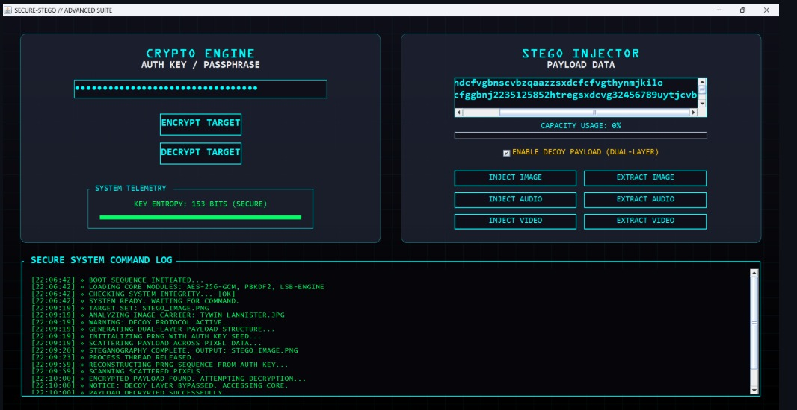

# SECURE-STEGO // ADVANCED CYBERSECURITY SUITE

## TECHNICAL OVERVIEW
SECURE-STEGO is a high-integrity cybersecurity application developed in Java. The suite provides a multi-layered defense mechanism by integrating AES-256-GCM authenticated encryption with PRNG-seeded steganography. The primary objective of the system is to achieve covert data transmission through "hidden-in-plain-sight" methodologies, ensuring both confidentiality and plausible deniability.

### SYSTEM ARCHITECTURE
The application utilizes a Nested Protection Model, frequently referred to as the "Double-Lock" system. This architecture ensures that even if the presence of hidden data is detected via forensic analysis, the payload remains protected by military-grade cryptographic standards.

### 1. CRYPTOGRAPHIC LAYER
Cipher Standard: Implements Advanced Encryption Standard (AES) in Galois/Counter Mode (GCM) for authenticated encryption.
Key Derivation: Utilizes PBKDF2 (Password-Based Key Derivation Function 2) with 65,536 iterations to transform user-defined passphrases into 256-bit keys.
Entropy Analytics: The system includes a real-time Shannon Entropy calculator to evaluate the mathematical strength of the Auth Key.
Integrity Verification: GCM authentication tags provide built-in tamper detection; any unauthorized modification of the encrypted artifact results in a decryption failure.

### 2. STEGANOGRAPHY LAYER
PRNG-Scatter Logic: To defeat Chi-square statistical steganalysis, the system uses a Pseudo-Random Number Generator (PRNG) seeded by the Auth Key to scatter data bits across non-sequential pixels or samples.
LSB Injection (Image/Audio): Implements Least Significant Bit modification within the spatial domain of images and PCM samples of audio files.
EOF Metadata Injection (Video): Utilizes End-of-File injection for video containers, ensuring compatibility with standard media players while maintaining high-speed processing.

### KEY FEATURES
Dual-Layer Decoy Protocol: Enables a plausible deniability scenario where a secondary, harmless message can be extracted using a decoy password.
MIME-Type Masking: Allows the user to disguise encrypted artifacts as harmless system-level files (e.g., .dll, .sys) to evade automated forensic scanners.
System Telemetry: A real-time command log provides technical feedback on encryption duration, bit-depth, and algorithm status.
Capacity Analysis: Dynamic calculation of the carrier file's bit-density to prevent visible artifacts or audible distortion during injection.

### INSTALLATION AND REQUIREMENTS
Environment: Java Development Kit (JDK) 17 or higher.
Dependencies: Swing UI library and standard Java Cryptography Extension (JCE).
Hardware: Optimized for systems with dedicated GPUs; tested on NVIDIA GeForce GTX 1650.

### OPERATIONAL INSTRUCTIONS
### DATA ENCRYPTION
Navigate to the Crypto Engine panel.
Input a high-entropy passphrase into the Auth Key field.
Select Encrypt Target and choose the source file.
Specify the output destination; utilize MIME-masking if required.

### STEGANOGRAPHY INJECTION
Load a carrier file (PNG, WAV, MP4) via the drag-and-drop interface.
Input the target message into the Payload Data field.
Monitor the Capacity Usage Meter to ensure the payload is within safe limits.
Enable Decoy Payload if multi-layer protection is desired.
Select the appropriate Inject command to execute the PRNG-Scatter algorithm.
image

